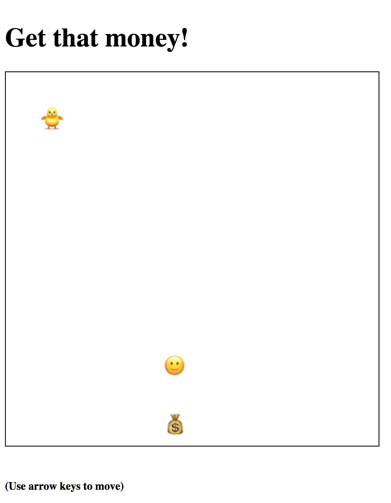

#NinjaDefense

[Game Link](https://hhouston.github.io/towerdefense-aa/)

## Background

Tower Defense games if you are not familiar consist of enemy pawns all trying to reach the same destination without being eliminated. The goal of the player is to strategically place their towers so that they are able to eliminate the most enemy pawns possible.

The goal of NinjaDefense is just the opposite. Strategically navigate your ninja sneak into the castle, but watch out for the towers!

## Functionality & MVP

With the Tower Defense Game, users will be able to:

- [ ] Navigate ninja (player)
- [ ] Towers that shoot enemies
- [ ] Win or Lose

## Wireframes

This game will have a grid, with a path for enemy pawns, area for users to place towers, and spots where users are unable to build. The main screen keeps track of the pausing and speeding-up of the game on the right with the level and number of lives displayed on the left. The bottom area displays towers to build when a tile is clicked.

## Architecture and Technologies

This project will be implement with the following technologies:

- Vanilla JavaScript for manipulation of the DOM
- Canvas.js to display a board with tower and enemy pieces
- Webpack to bundle the project scripts

## Code Snippets

### Checks if the ninja is in range of the tower

  inRange() {
    let inRange = false;
    this.towers.forEach(tower => {
      this.enemies.forEach(enemy => {

        let towerX = tower.pos[0];
        let towerY = tower.pos[1];

        let enemyX = enemy.pos[0];
        let enemyY = enemy.pos[1];

        let dist = Util.dist([towerX, towerY], [enemyX, enemyY]);

        if(dist < 160){
          let bulletX = enemyX - towerX;
          let bulletY = enemyY - towerY;

          tower.fireBullet(bulletX, bulletY);
          inRange = true;
        }
      });
    });
    return inRange;
  }

### Tracks ninja to decide WHERE to shoot

  fireBullet(bulletX, bulletY) {

    const relVel = Util.scale(
      Util.dir(this.vel),
      Bullet.SPEED
    );

    //calculate bulletVel based on enemy position
    let bulletVel = [
      bulletX, bulletY
    ];

    bulletVel = Util.normalize(bulletVel);
    bulletVel = Util.scale(bulletVel, Bullet.SPEED);

    const bullet = new Bullet({
      pos: this.pos,
      vel: bulletVel,
      color: 'red',
      game: this.game
    });

    this.game.add(bullet);
  }

### Future Features

- [ ] High Score
- [ ] New Levels
