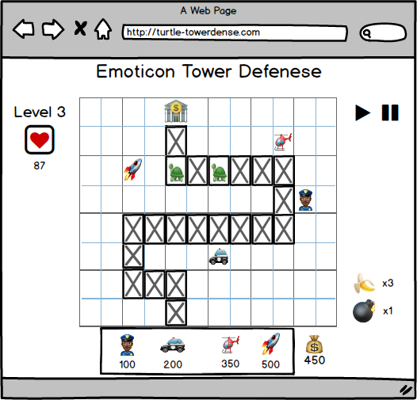
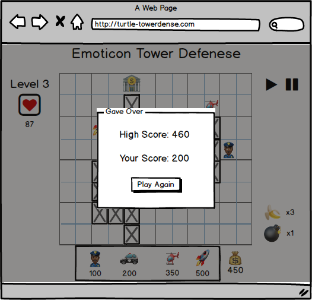

#NinjaDefense

[Heroku Link](https://towerdefense-aa.herokuapp.com/)

## Background

Tower Defense games if you are not familiar consist of enemy pawns all trying to reach the same destination without being eliminated. The goal of the player is to strategically place their towers so that they are able to eliminate the most enemy pawns possible.

The goal of NinjaDefense is just the opposite. Strategically navigate your ninja sneak into the castle, but watch out for the towers!

## Functionality & MVP

With the Tower Defense Game, users will be able to:

- [ ] Start and stop the game
- [ ] Towers that shoot enemies
- [ ] Keep score and loose

## Wireframes
* [wireframes](wireframes)

This game will have a grid, with a path for enemy pawns, area for users to place towers, and spots where users are unable to build. The main screen keeps track of the pausing and speeding-up of the game on the right with the level and number of lives displayed on the left. The bottom area displays towers to build when a tile is clicked.

Game Over Modal: Displays game score and allows the user to play again

## Architecture and Technologies

This project will be implement with the following technologies:

- Vanilla JavaScript for manipulation of the DOM
- Canvas.js to display a board with tower and enemy pieces
- Webpack to bundle the project scripts

## Implementation Timeline

### Phase I: Board and Game Pieces (2 days)

**Objective:** Set up of of the fist level layout with the appropriate pieces (turtles, emoji towers, bank at the end point). Set up back end game logic.

### Phase II: Add javascript listeners (2 days)

**Objective:** Add the appropriate javascript listeners to the board to add/buy towers. Implement game logic of towers shooting and turtles taking damage and being cleared from the screen.

### Phase III: Keep score (1 day)

**Objective:** Adds a way to decrease users number of lives and end the game when it reaches 0 and display the user's score

### Bonus Features

- [ ] High Score
- [ ] New Levels
